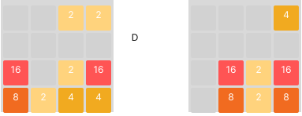

# 2048

In dieser Aufgabe erstellst du mithilfe von Javascript, HTML und CSS eine eigene Version des Spiels "2048".

 > 2048 ist ein beliebtes Puzzlespiel, bei dem der Spieler durch Kombinieren von Zahlenkacheln versucht,
 > eine Kachel mit dem Wert 2048 zu erreichen. Das Spiel wird auf einem 4x4-Gitter gespielt, auf dem sich
 > zu Beginn zwei Kacheln mit dem Wert 2 befinden. Der Spieler kann die Kacheln in vier Richtungen bewegen
 > (oben, unten, links, rechts). Bei jedem Zug bewegen sich alle Kacheln so weit wie möglich in die ausgewählte Richtung
 > und zwei benachbarte Kacheln mit dem gleichen Wert werden zu einer Kachel mit dem doppelten Wert kombiniert.
 > Das Spiel endet, wenn kein Zug mehr möglich ist oder der Spieler die 2048-Kachel erreicht hat.

 Beispiel:
 

Das Spiel endet, sobald eine Kachel den Wert 2048 erreicht (gewonnen), oder das Feld voll ist und keine Kombinationsmöglichkeiten mehr bestehen. (verloren) 

Für das Spiel existiert bereits eine index.html und index.js Datei. Um das Spiel zu starten, führe im Terminal den Befehl `live-server src/` aus und rufe danach die URL `http://127.0.0.1:8080` auf.
